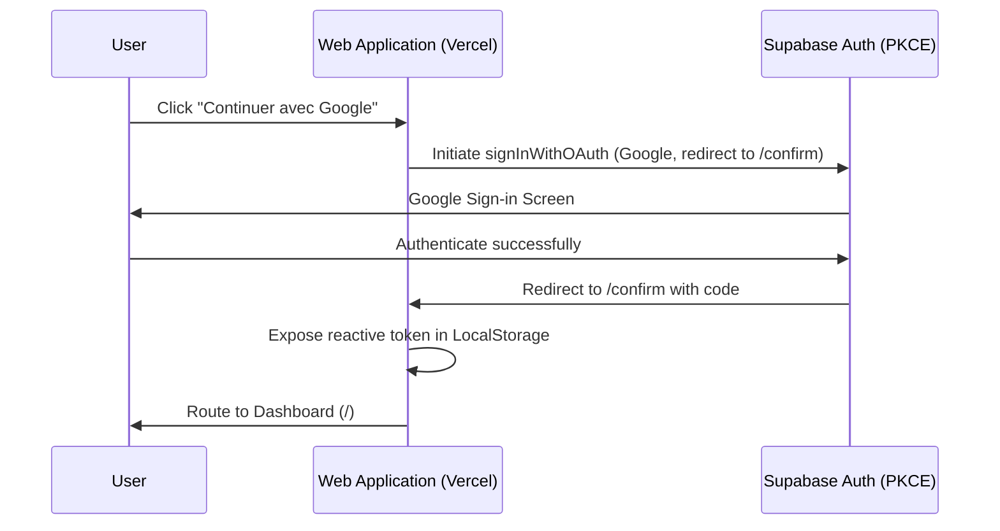
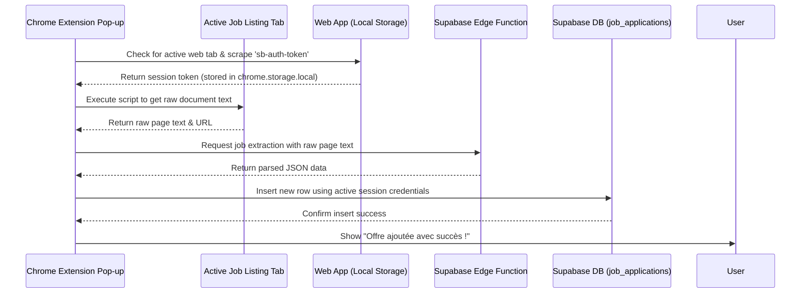

# JobTracker 📋 — Project Context & Specification

JobTracker is a modern web application designed to centralize, track, and manage job applications. It includes automated job posting extraction using AI, a Chrome extension for scraping jobs directly from standard boards, and is built on a Nuxt 4, Vue 3, Supabase, and Tailwind CSS tech stack.

---

## 🛠 Tech Stack & Architecture

### Frontend (Nuxt 4 SPA)
- **Framework:** [Nuxt 4](https://nuxt.com/) (configured in SPA mode with `ssr: false`).
- **Core UI Libraries:** Vue 3, Pinia (for state management), Tailwind CSS (for styling).
- **Design System:** Custom CSS variables mapping shadcn-like color schemes (light and dark mode), with Tailwind custom layers defined in `app/assets/css/tailwind.css`.
- **Fonts & Transitions:** Google Fonts (`Inter`), with smooth Nuxt page transitions enabled (`pageTransition: { name: 'page', mode: 'out-in' }`).
- **Theme management:** System preference with fallback to dark mode, controlled by `@nuxtjs/color-mode`.

### Backend & Database (Supabase)
- **Database:** PostgreSQL hosted on [Supabase](https://supabase.com/).
- **Auth:** Supabase Auth with Google OAuth (PKCE Flow).
- **Serverless Logic:** Supabase Edge Functions (`functions/analyze-job`) written in TypeScript/Deno.
- **Client Integration:** `@nuxtjs/supabase` module configured to use `localStorage` for PKCE token persistence in SPA mode.

### AI Processing (Groq API)
- **Model:** LLaMA 3.1 8B Instant (`llama-3.1-8b-instant`) via Groq.
- **Purpose:** Extracts structured details (company name, job profile, proposed salary, main missions, primary skills, company info) from raw job description texts or public job links.

### Chrome Extension Scraper
- **Format:** Manifest V3 extension.
- **Functionality:** Scrapes the active tab's inner text, syncs the user session dynamically from the hosted web application (`localStorage`), invokes the Supabase Edge Function to analyze the job details, and directly inserts the new record into the Supabase database.

---

## 📁 Directory Structure

```
.
├── .agent/                    # Workspace agent tools and workflows
├── app/                       # Nuxt 4 application root
│   ├── assets/
│   │   └── css/
│   │       └── tailwind.css   # Main CSS & custom design system tokens
│   ├── components/            # Vue components (Modals, Tables, Cards, Badges)
│   ├── layouts/
│   │   └── default.vue        # Standard page layout with Header & Footer
│   ├── middleware/
│   │   └── auth.global.ts     # Global client-side navigation guard
│   ├── pages/                 # Routing pages (Dashboard, Login, Confirm, Privacy)
│   ├── stores/
│   │   └── applications.ts    # Pinia store for applications CRUD operations
│   ├── types/                 # TypeScript interfaces
│   └── utils/
│       └── formatters.ts      # String & JSON parser helpers (e.g. salary, skills)
├── extension/                 # Chrome Extension source code (V3)
│   ├── manifest.json          # Extension permissions and configurations
│   ├── popup.html             # Pop-up UI
│   ├── popup.js               # Scraper, authentication bridging, and API integration
│   └── content.js             # Basic content extraction scripts
├── openspec/                  # OpenSpec configuration and specs root
│   └── config.yaml            # Schema profile rules
├── supabase/                  # Supabase database & serverless configurations
│   ├── functions/
│   │   └── analyze-job/       # Edge Function to invoke Groq LLaMA 3.1 model
│   └── schema.sql             # SQL database table definitions, RLS, and triggers
```

---

## 🗄 Database Schema & RLS

The database is built on a single table `job_applications` under the `public` schema in PostgreSQL. Row Level Security (RLS) is enabled to ensure users can only access their own records.

### Database Table: `public.job_applications`

| Column | Type | Constraints / Default | Description |
| :--- | :--- | :--- | :--- |
| `id` | `UUID` | `DEFAULT gen_random_uuid()` / `PRIMARY KEY` | Unique application identifier |
| `user_id` | `UUID` | `NOT NULL` / `REFERENCES auth.users(id)` | Linked to Supabase auth user |
| `url` | `TEXT` | `DEFAULT ''` | URL to the original job posting |
| `company_name`| `TEXT` | `NOT NULL DEFAULT ''` | Name of the hiring company |
| `company_info`| `TEXT` | `DEFAULT ''` | Brief company overview |
| `job_profile` | `TEXT` | `DEFAULT ''` | Job title (e.g., Software Engineer) |
| `main_missions`| `TEXT` | `DEFAULT ''` | Bulleted list of responsibilities |
| `primary_skills`| `TEXT`| `DEFAULT ''` | Comma-separated list of skills |
| `proposed_salary`| `TEXT`| `DEFAULT ''` | Extracted salary range or text |
| `applied_at`  | `TIMESTAMPTZ`| `NULL` | Timestamp of when user submitted application |
| `company_feedback`| `TEXT`| `DEFAULT ''` | Notes or responses received |
| `status`      | `TEXT` | `NOT NULL DEFAULT 'draft'` | ENUM: `draft`, `applied`, `interview`, `rejected`, `accepted` |
| `created_at`  | `TIMESTAMPTZ`| `DEFAULT NOW()` | Date of row creation |
| `updated_at`  | `TIMESTAMPTZ`| `DEFAULT NOW()` | Date of last modification |

### Policies & Performance Triggers
1. **Indices:**
   - `idx_job_applications_user_id` on `user_id` for fast query filtering.
   - `idx_job_applications_status` on `status` to optimize dashboard filters.
2. **RLS Policies:**
   - `"Users can view their own applications"`: `auth.uid() = user_id` for SELECT.
   - `"Users can insert their own applications"`: `auth.uid() = user_id` for INSERT.
   - `"Users can update their own applications"`: `auth.uid() = user_id` for UPDATE.
   - `"Users can delete their own applications"`: `auth.uid() = user_id` for DELETE.
3. **Database Triggers:**
   - A trigger executes function `public.handle_updated_at()` before any row update to auto-refresh `updated_at` to `NOW()`.

---

## 🔐 Authentication Flow (PKCE)

JobTracker uses Supabase's Google OAuth provider with PKCE flow for secure web and extension authentication.



### Authentication Protection
A global middleware `auth.global.ts` checks user session credentials on load.
- **Public Paths:** `/`, `/login`, `/confirm`, `/privacy`.
- **Protected Paths:** All other routing paths will redirect unauthenticated users to `/login`.
- Guests can see the landing/dashboard page `/` but cannot create, modify, or delete entries (they are redirected to `/login` if write actions are attempted).

---

## 🤖 AI Parsing Integration

When creating a new application, users can paste a job posting URL and click **"IA Parse"**.

1. **Invocation:** The modal calls `supabase.functions.invoke('analyze-job', { body: { url } })`.
2. **Edge Function Behavior:**
   - If a URL is passed, it fetches the HTML content and strips tags.
   - If raw text is passed, it uses the text directly.
   - It forwards the content to Groq API with the prompt:
     ```
     Analyze this job offer content and extract a clean JSON object. 
     Fields: company_name, job_profile, proposed_salary (as text), main_missions, primary_skills (comma separated), company_info.
     ```
   - Invokes `llama-3.1-8b-instant` with `response_format: { type: "json_object" }` to output a structured JSON response.

---

## 🧩 Chrome Extension (Scraper & Session Sync)

The Chrome extension allows users to parse and log job applications from their current browser tab in real time.



### Key Extension Logic
- **Authentication Bridging:** When the popup is opened, it scans for active tabs targeting the hosted web application (`*://job-tracker-opal-ten.vercel.app/*`). It executes a script in that tab to retrieve `localStorage.getItem('sb-erhalnpgzttnhiilopcp-auth-token')` and saves it locally in `chrome.storage.local`.
- **Auth Bridging Fallback:** If not logged in, clicking the login button opens the web app to allow the user to authenticate.
- **Scrape Fallback:** If the AI Edge Function times out or fails (e.g. due to rate limits or API key absence), the extension defaults to regex-parsing the document title (splitting on typical separator characters `|`, `—`, `-`) to extract the company name and job title.

---

## 🎨 UI & Styling System

The application uses Tailwind CSS integrated via `@nuxtjs/tailwindcss` combined with CSS variables for dynamic light and dark theme modes.

### Key Classes
- `.card`: Standardized panel design with borders and dynamic backgrounds.
- `.input-field`: Custom input boxes adjusting border, ring colors, and focus states.
- `.btn-primary` & `.btn-secondary`: Custom action button layouts.
- `.btn-ghost`: Ghost buttons with hover background shifts.

### Color Palettes
CSS variables are modified dynamically by the `.dark` class added to `html` by `@nuxtjs/color-mode`:
- **Light Theme:** Off-white backgrounds (`#f3f3f3`), dark headers (`#18181b`), and white panels (`#ffffff`).
- **Dark Theme:** Solid black backgrounds (`#09090b`), white headers (`#fafafa`), and dark borders (`#27272a`).
